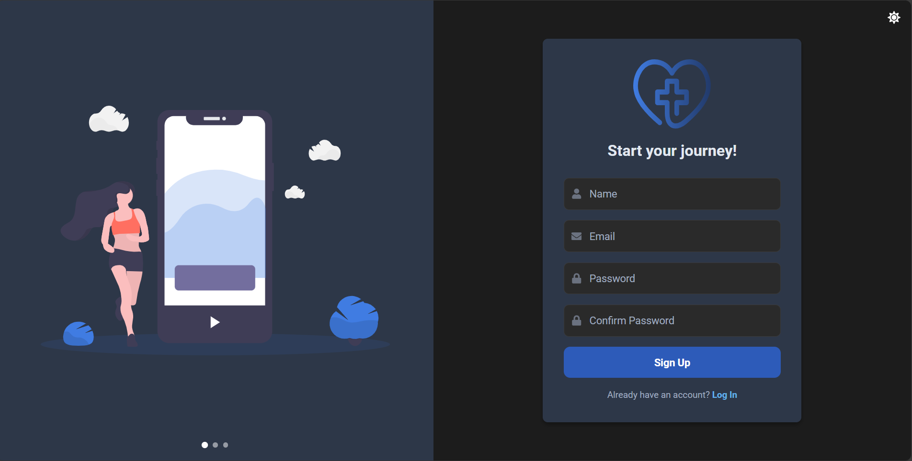
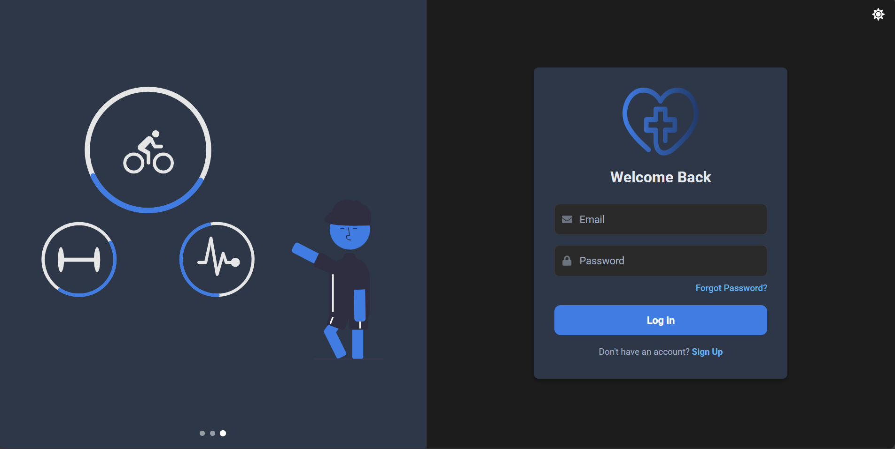

# LifeGuard: Wearable Health & Environmental Monitoring System

<p align="center">
  
</p>

## Table of Contents

- [Overview](#overview)
- [Target Audience](#target-audience)
- [Key Features](#key-features)
- [Technical Specifications](#technical-specifications)
  - [Hardware](#hardware)
  - [Software Stack](#software-stack)
    - [Web Platform](#web-platform)
    - [Mobile Application](#mobile-application)
- [Getting Started](#getting-started)
  - [Prerequisites](#prerequisites)
  - [Installation](#installation)
- [Project Structure](#project-structure)
- [System Architecture](#system-architecture)
- [API Documentation](#api-documentation)
- [Real World Applications](#real-world-applications)
- [Team](#team)
- [Screenshots](#screenshots)
- [Support & Contact](#support--contact)


## Overview

LifeGuard is an innovative health and environmental monitoring system that addresses critical gaps in personal safety, accessibility, and preventive healthcare. By integrating advanced sensors with machine learning, it delivers real-time data on health metrics and environmental parameters.

### Target Audience
- Aging population (55+ years)
- Health-conscious individuals (25-54 years)
- Industrial workers
- Healthcare providers

### Key Features
- Real-time health monitoring
- Fall detection using ML algorithms
- Activity recognition (walking, running, cycling)
- Environmental monitoring (temperature, humidity, air quality)
- Emergency alert system
- Cost-effective design for accessibility

## Technical Specifications

### Hardware
- **Board**: Arduino Nicla Sense ME
- **Battery**: LiPo 3.7V, 400mAh
- **Water Resistance**: IP67
- **Sensors**: 9 integrated sensors including:
  - Accelerometer & Gyroscope
  - Temperature & Humidity sensors
  - Barometric pressure sensor
  - Magnetometer
  - Gas sensors for VOCs, CO2, etc.

### Software Stack

#### Web Platform
- **Frontend**
  - React
  - TypeScript
  - Tailwind CSS
  - Redux
  - MapBox API

- **Backend**
  - .NET Core 8.0
  - PostgreSQL
  - JWT Authentication
  - SendGrid Email Service

#### Mobile Application
- **Framework**: Flutter
- **Features**:
  - Real-time monitoring
  - Activity tracking
  - Environmental alerts
  - Emergency contacts
  - Dark/Light theme

## Getting Started

### Prerequisites
- Node.js 18+
- .NET SDK 8.0
- Flutter SDK
- PostgreSQL

### Installation

1. Clone the repository:
```bash
git clone https://github.com/AWESOME04/LifeGuard.git
cd LifeGuard
```

2. Web Platform Setup:
```bash
cd web
npm install
npm start
```

3. Backend Setup:
```bash
cd backend
dotnet restore
dotnet run
```

4. Mobile App Setup:
```bash
cd mobile
flutter pub get
flutter run
```

## Project Structure
```
lifeguard/
├── hardware/         # PCB & enclosure designs
├── firmware/         # Arduino/C++ code
├── web/             # React dashboard
├── mobile/          # Flutter mobile app
├── backend/         # .NET Core API
└── docs/            # Documentation
```

- **Connectivity**: BLE/USB
- **Sensors**: 9 integrated sensors
- **Processing**: Edge computing with ML capabilities

## System Architecture


### Hardware Components
- Arduino Nicla Sense ME board
- Custom-designed enclosure
- Integrated sensor array


## API Documentation

### Authentication Endpoints
```http
POST /api/Account/register
POST /api/Account/login
POST /api/Account/verify-otp
POST /api/Account/resend-otp
POST /api/Account/forgot-password
POST /api/Account/reset-password
GET /api/Account/id
```

### Other routes coming soon...

## Real World Applications

- **Healthcare**
  - Remote patient monitoring
  - Fall prevention for elderly
  - Emergency response automation

- **Industrial Safety**
  - Worker safety monitoring
  - Air quality monitoring
  - Environmental hazard alerts

- **Personal Wellness**
  - Activity tracking
  - Environmental impact monitoring
  - Weather-related health warnings

## Team

### Core Team
- [Evans Acheampong](https://github.com/AWESOME04) - 10987644
  - Frontend Development
  - Hardware Integration
  - Documentation

- [Michael Adu-Gyamfi](https://github.com/mikkayadu) - 10980219
  - Backend Development
  - Machine Learning
  - System Security

### Advisors
- Dr. Percy Okae - Project Supervisor
- Chiratidzo Matowe - Advisor
- Marvin Rotermund - Ambassador, Embedded Learning Challenge

## Screenshots

<p align="center">
  
</p>

<p align="center">
  
</p>

<p align="center">
  
</p>

## Support & Contact

For support or inquiries:
- Email: evansachie01@gmail.com or michaeladugyamfi76@gmail.com
- Deployed frontend: [https://lifeguard-vq69.onrender.com](https://lifeguard-vq69.onrender.com)
- Deployed backend: [https://lifeguard-hiij.onrender.com/api](https://lifeguard-hiij.onrender.com/api)
- Deployed node server: [https://lifeguard-node.onrender.com](https://lifeguard-node.onrender.com)
