# LifeGuard: Wearable Health & Environmental Monitoring System

<div align="center">

[](https://example.com/build-status)
[](https://github.com/AWESOME04/LifeGuard/releases)
[](https://github.com/AWESOME04/LifeGuard/stargazers)
[](https://github.com/AWESOME04/LifeGuard/network/members)
[](https://example.com/coverage)
[](https://github.com/AWESOME04/LifeGuard/tree/main/docs)
[](https://doi.org/10.5281/zenodo.1234567)

<br />

<p align="center">
  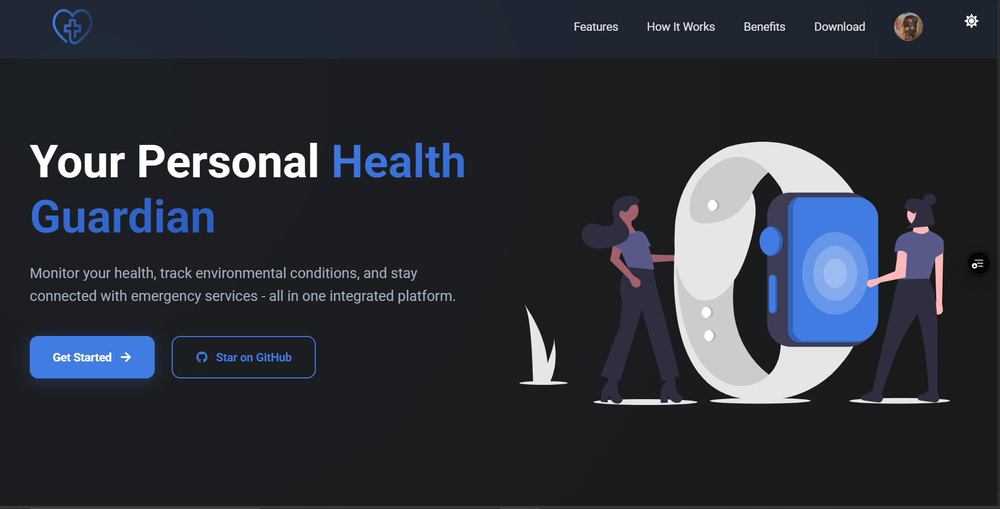
</p>

<p align="center">
  <strong>Accessible health and environmental monitoring for everyone, everywhere.</strong>
</p>

<p align="center">
  <a href="#demo">View Demo</a>
  ·
  <a href="https://github.com/AWESOME04/LifeGuard/issues/new?template=bug_report.md">Report Bug</a>
  ·
  <a href="https://github.com/AWESOME04/LifeGuard/issues/new?template=feature_request.md">Request Feature</a>
</p>

</div>

## 📋 Table of Contents

- [🌟 Overview](#-overview)
- [✨ Key Features](#-key-features)
- [🛠️ Technical Specifications](#%EF%B8%8F-technical-specifications)
- [🚀 Getting Started](#-getting-started)
- [🏗️ Project Structure](#%EF%B8%8F-project-structure)
- [🧩 System Architecture](#-system-architecture)
- [📚 API Documentation](#-api-documentation)
- [👥 Team](#-team)
- [📷 Screenshots](#-screenshots)
- [💬 Support & Contact](#-support--contact)

## 🌟 Overview

LifeGuard is an innovative wearable system that bridges critical gaps in personal safety, accessibility, and preventive healthcare. By integrating advanced sensors with machine learning algorithms, it delivers real-time insights on health metrics and environmental parameters, making safety monitoring accessible and affordable for all.

Our solution stands out as a cost-effective and comprehensive alternative to premium devices, enabling equitable access for underserved populations, including the elderly and industrial workers in developing regions.

<div align="center">
<table>
<tr>
<td align="center">
<strong>60%</strong><br>Cheaper than Apple Watch
</td>
<td align="center">
<strong>72h</strong><br>Battery Life
</td>
<td align="center">
<strong>9</strong><br>Integrated Sensors
</td>
<td align="center">
<strong>IP67</strong><br>Water Resistance
</td>
</tr>
</table>
</div>

## ✨ Key Features

- **📊 Comprehensive Health Monitoring**
  - Real-time vitals tracking
  - Fall detection with 95% accuracy
  - Activity recognition (walking, running, cycling)
  - Custom health thresholds

- **🌡️ Environmental Sensing**
  - Air quality analysis (VOCs, CO2)
  - Temperature and humidity monitoring
  - Barometric pressure tracking
  - Pollution mapping with MapBox integration

- **⚠️ Smart Alert System**
  - Emergency contact notifications
  - Geolocation sharing
  - Customizable thresholds
  - Automated emergency response

- **💼 Multi-Platform Support**
  - Web dashboard with real-time analytics
  - Mobile app (iOS/Android) with dark/light themes
  - Data synchronization across devices
  - Offline functionality

## 🛠️ Technical Specifications

### Hardware Components

<table>
  <tr>
    <td width="33%"><strong>Core Board</strong></td>
    <td width="67%">Arduino Nicla Sense ME</td>
  </tr>
  <tr>
    <td><strong>Power</strong></td>
    <td>3.7V LiPo Battery (400mAh)</td>
  </tr>
  <tr>
    <td><strong>Battery Life</strong></td>
    <td>72 hours with optimized power management</td>
  </tr>
  <tr>
    <td><strong>Durability</strong></td>
    <td>IP67 water and dust resistance</td>
  </tr>
  <tr>
    <td><strong>Weight</strong></td>
    <td>Approximately 45g (including enclosure)</td>
  </tr>
  <tr>
    <td><strong>Connectivity</strong></td>
    <td>BLE 5.0, WiFi (via companion device)</td>
  </tr>
  <tr>
    <td><strong>Sensors</strong></td>
    <td>
      • Accelerometer & Gyroscope (motion detection)<br>
      • Temperature & Humidity sensors<br>
      • Barometric pressure sensor<br>
      • Magnetometer<br>
      • Gas sensors (VOCs, CO2)
    </td>
  </tr>
</table>

### Software Architecture

<div align="center">
<table>
<tr>
<th>Frontend</th>
<th>Backend</th>
<th>Mobile</th>
<th>ML & Analytics</th>
</tr>
<tr>
<td>
• React 18<br>
• TypeScript<br>
• Tailwind CSS<br>
• Redux Toolkit<br>
• MapBox API
</td>
<td>
• .NET 8.0<br>
• PostgreSQL<br>
• JWT Auth<br>
• SendGrid<br>
• Firebase
</td>
<td>
• Flutter 3.19<br>
• Provider State<br>
• Material 3<br>
• Offline Mode<br>
• SharedPreferences
</td>
<td>
• LSTM Networks<br>
• TinyML Models<br>
• Edge Inference<br>
• Time-series Analysis<br>
• Sensor Fusion
</td>
</tr>
</table>
</div>

## 🚀 Getting Started

### Prerequisites

- Node.js 18+
- .NET SDK 8.0
- Flutter SDK 3.19+
- PostgreSQL 15+
- Arduino IDE (for firmware development)

### Quick Start Guide

1. **Clone the repository**

```bash
git clone https://github.com/AWESOME04/LifeGuard.git
cd LifeGuard
```

2. **Set up environment files**

```bash
cp backend/.env.example backend/.env
cp node-server/.env.example node-server/.env
cp web/.env.example web/.env
cp mobile/.env.example mobile/.env
```

3. **Start the backend server**

```bash
cd backend
dotnet restore
dotnet run
```

4. **Launch the web dashboard**

```bash
cd web
npm install
npm start
```

5. **Run the mobile application**

```bash
cd mobile
flutter pub get
flutter run
```

### Docker Setup

```bash
docker-compose up -d
```

This will start the web dashboard, API, and database services in containers.

## 🏗️ Project Structure

```
lifeguard/
├── .github/                    # GitHub actions and templates
├── firmware/                   # Arduino code and sketches
│   ├── test-sketches/          # Sketches to test Nicla Sense ME
│   └── we-dashboard/           # Web dashboard for reading sensor data
├── web/                        # React dashboard
│   ├── public/                 # Static assets
│   ├── src/                    # React components
│   │   ├── components/         # Reusable UI components
│   │   ├── pages/              # Main application views
│   │   ├── services/           # API integrations
│   │   └── store/              # Redux state management
├── mobile/                     # Flutter mobile app
│   ├── lib/                    # Dart code
│   │   ├── models/             # Data models
│   │   ├── screens/            # UI screens
│   │   ├── services/           # Business logic
│   │   └── widgets/            # Reusable components
├── backend/                    # .NET Core API
│   ├── Controllers/            # API endpoints
│   ├── Models/                 # Data structures
│   ├── Services/               # Business logic
│   └── Middleware/             # Request processing
├── node-server/                # Node.js backend service
│   ├── controllers/            # Route controllers
│   ├── models/                 # Database schemas
│   ├── routes/                 # API routes
│   ├── services/               # Business logic
│   ├── middleware/             # Express middleware
│   └── utils/                  # Helper functions
├── docs/                       # Documentation
│   ├── api/                    # API reference
│   ├── images/                 # Project images
│   └── tutorials/              # User guides
└── .devcontainer/              # Development container config
```

## 🧩 System Architecture

<div align="center">
  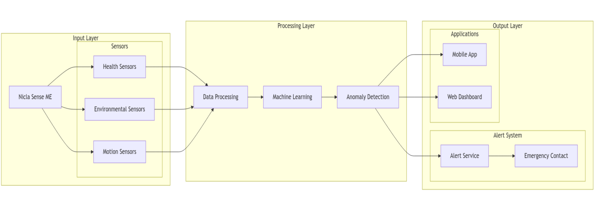
</div>


### System Overview

<div align="center">
  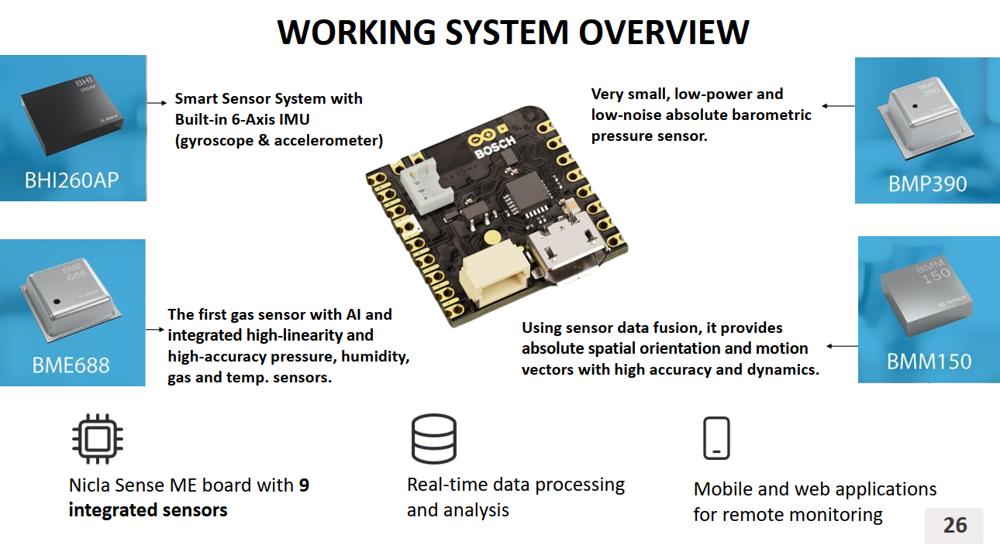
</div>


### Data Flow

1. **Data Collection:**
   - Sensors gather health and environmental data
   - Edge processing for initial analysis

2. **Data Processing:**
   - TinyML models analyze patterns on-device
   - Critical events trigger immediate alerts

3. **Data Storage & Analysis:**
   - Cloud storage with HIPAA-compliant encryption
   - Advanced analytics for long-term trends

4. **User Interface:**
   - Real-time dashboard visualization
   - Mobile alerts and insights

## 📚 API Documentation

Below is an overview of the core endpoints for the LifeGuard API:

### Account Endpoints

| **Method** | **Endpoint**                         | **Description**                                      |
|------------|--------------------------------------|------------------------------------------------------|
| GET        | `/`                                  | Health check or base endpoint                        |
| POST       | `/api/Account/login`                 | Authenticate a user using email and password         |
| POST       | `/api/Account/register`              | Register a new user account                          |
| POST       | `/api/Account/forgot-password`       | Initiate the password recovery process               |
| POST       | `/api/Account/ResendOTP`             | Resend OTP to the user                               |
| POST       | `/api/Account/VerifyOTP`             | Verify the OTP provided by the user                  |
| POST       | `/api/Account/ResetPassword`         | Reset the user's password using a token              |
| GET        | `/api/Account/{id}`                  | Retrieve basic account information by ID             |
| POST       | `/api/Account/CompleteProfile`       | Submit additional profile details                    |
| GET        | `/api/Account/GetProfile/{id}`       | Retrieve detailed user profile information           |

### Photo Endpoints

| **Method** | **Endpoint**         | **Description**                                         |
|------------|----------------------|---------------------------------------------------------|
| POST       | `/{id}/photo`        | Upload a photo for the user with the specified ID       |
| DELETE     | `/{id}/photo`        | Delete the user's photo identified by the given ID      |
| GET        | `/{id}/photo`        | Retrieve the photo for the user with the specified ID    |


Complete API documentation would be posted soon...

## 👥 Team

### Core Developers

<table>
  <tr>
    <td align="center"><a href="https://github.com/AWESOME04"><br /><sub><b>Evans Acheampong</b></sub></a><br />Frontend & Hardware</td>
    <td align="center"><a href="https://github.com/mikkayadu"><br /><sub><b>Michael Adu-Gyamfi</b></sub></a><br />Backend & ML</td>
  </tr>
</table>

### Academic Advisors

<table>
  <tr>
    <td align="center"><br /><sub><b>Dr. Percy Okae</b></sub><br />Project Supervisor</td>
    <td align="center"><br /><sub><b>Chiratidzo Matowe</b></sub><br />Advisor</td>
    <td align="center"><br /><sub><b>Marvin Rotermund</b></sub><br />Ambassador, Embedded Learning Challenge</td>
  </tr>
</table>

## 📷 Screenshots

### Web Dashboard

<div align="center">
  <div style="display: flex; flex-wrap: wrap; justify-content: center; gap: 20px; margin-top: 30px;">
    <div>
      <h4>Dashboard</h4>
      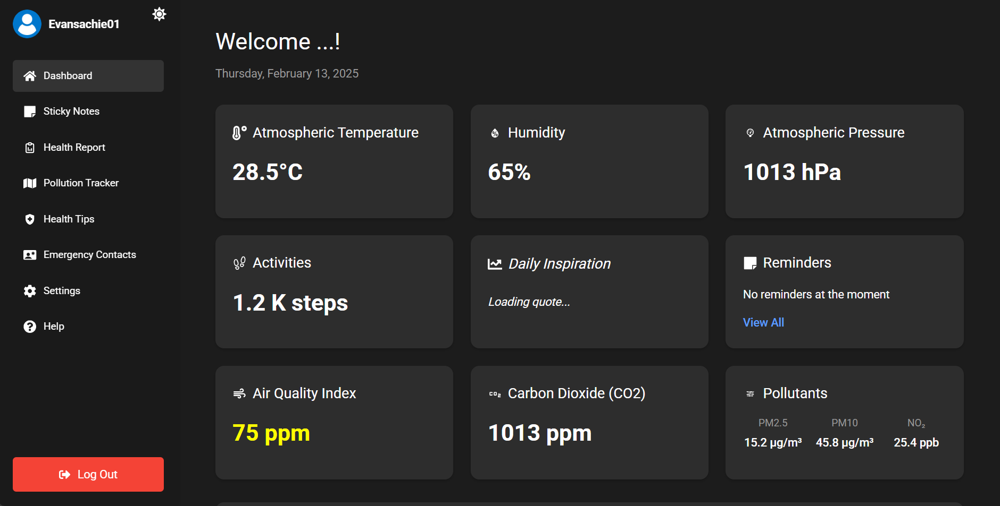
    </div>
  </div>
  
  <div style="display: flex; flex-wrap: wrap; justify-content: center; gap: 20px; margin-top: 20px;">
    <div>
      <h4>Analytics Panel</h4>
      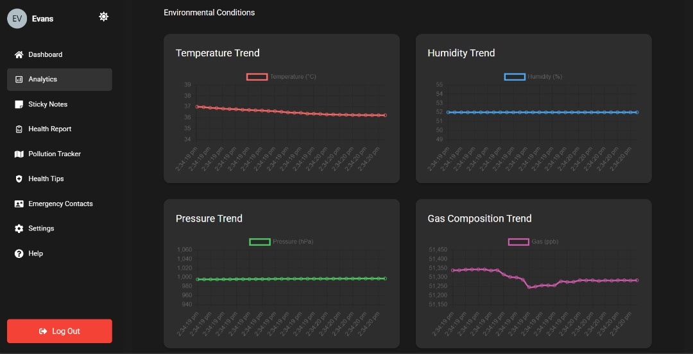
    </div>
    <div>
      <h4>Sticky Notes</h4>
      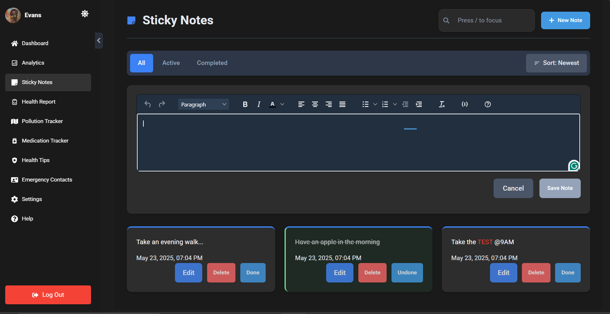
    </div>
  </div>
  
  <div style="display: flex; flex-wrap: wrap; justify-content: center; gap: 20px; margin-top: 20px;">
    <div>
      <h4>Health Report</h4>
      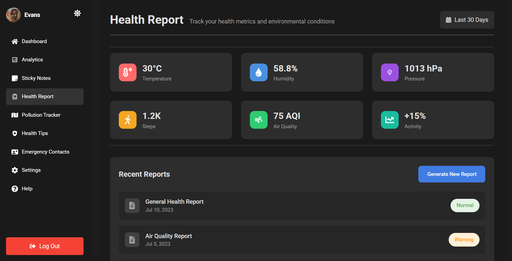
    </div>
    <div>
      <h4>Pollution Map</h4>
      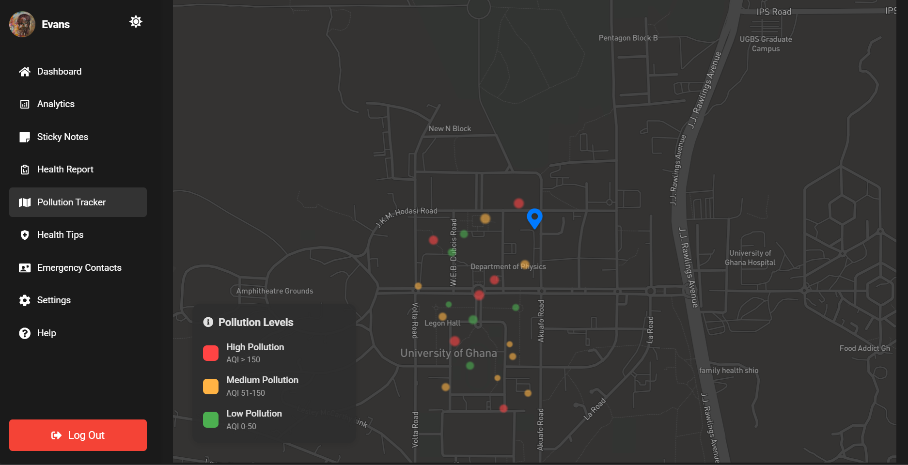
    </div>
  </div>

  <div style="display: flex; flex-wrap: wrap; justify-content: center; gap: 20px; margin-top: 20px;">
    <div>
      <h4>Health Tips</h4>
      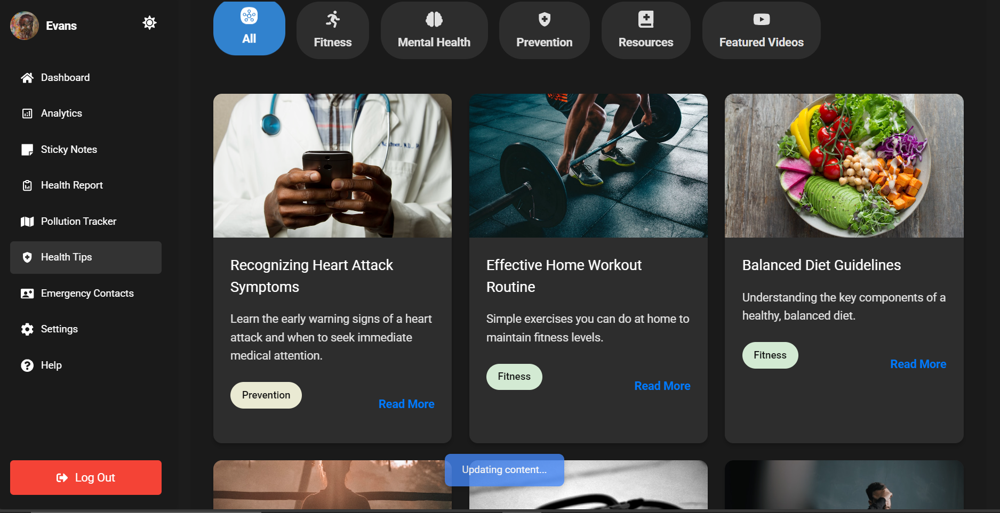
    </div>
    <div>
      <h4>Emergency Contacts</h4>
      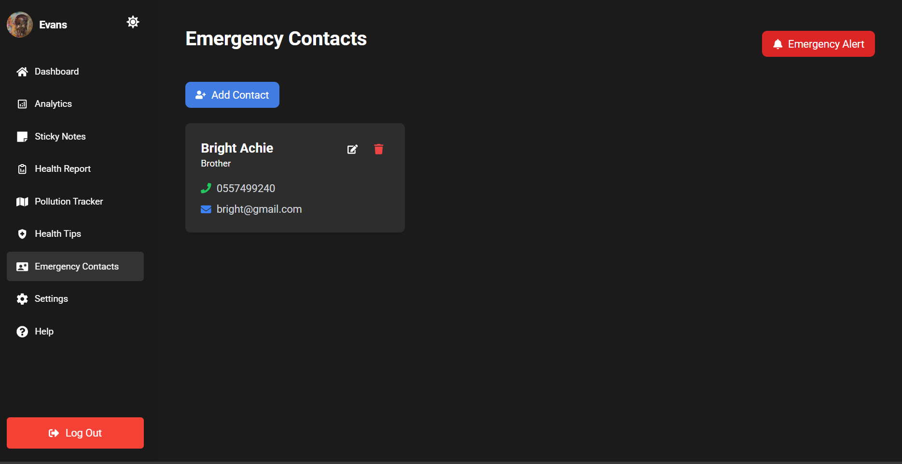
    </div>
  </div>

  <div style="display: flex; flex-wrap: wrap; justify-content: center; gap: 20px; margin-top: 20px;">
    <div>
      <h4>Help</h4>
      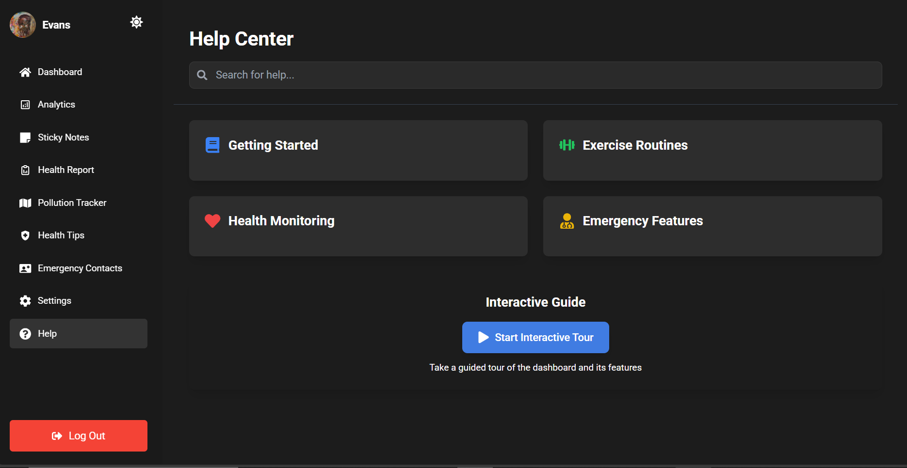
    </div>
    <div>
      <h4>Profile</h4>
      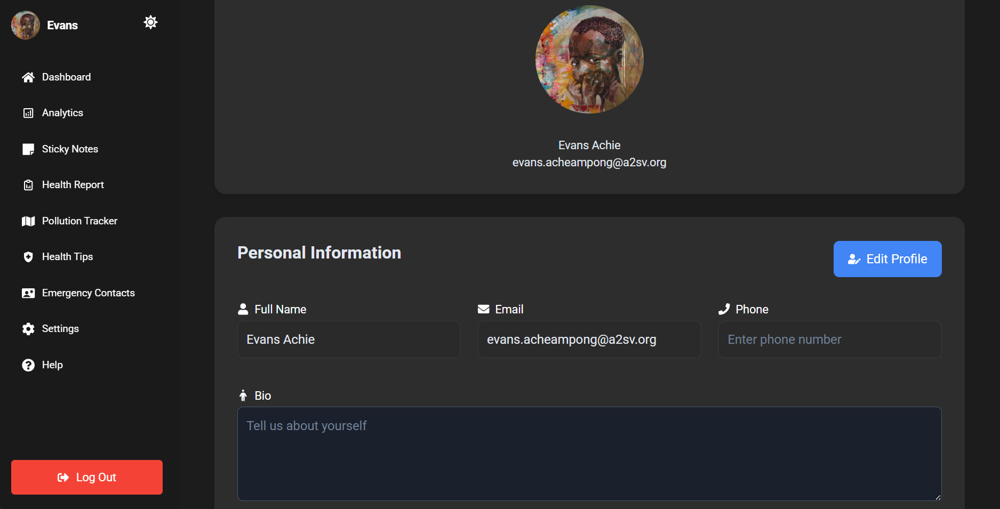
    </div>
  </div>
</div>


## 💬 Support & Contact

<table>
  <tr>
    <td>
      <strong>Frontend:</strong><br>
      <a href="https://lifeguard-vert.vercel.app">https://lifeguard-vert.vercel.app</a>
    </td>
    <td>
      <strong>Backend:</strong><br>
      <a href="https://lifeguard-hiij.onrender.com/api">https://lifeguard-hiij.onrender.com/api</a>
    </td>
  </tr>
  <tr>
    <td>
      <strong>Node Server:</strong><br>
      <a href="https://lifeguard-node.onrender.com">https://lifeguard-node.onrender.com</a>
    </td>
    <td>
      <strong>Email Support:</strong><br>
      <a href="mailto:evansachie01@gmail.com">evansachie01@gmail.com</a><br>
      <a href="mailto:michaeladugyamfi76@gmail.com">michaeladugyamfi76@gmail.com</a>
    </td>
  </tr>
</table>

*Happy coding!*