# LifeGuard: Wearable Health & Environmental Monitoring System

<div align="center">

[](https://example.com/build-status)
[](https://github.com/evansachie/LifeGuard/releases)
[](https://github.com/evansachie/LifeGuard/stargazers)
[](https://github.com/evansachie/LifeGuard/network/members)
[](https://example.com/coverage)
[](https://github.com/evansachie/LifeGuard/tree/main/docs)
[](https://doi.org/10.5281/zenodo.1234567)

<br />

<p align="center">
  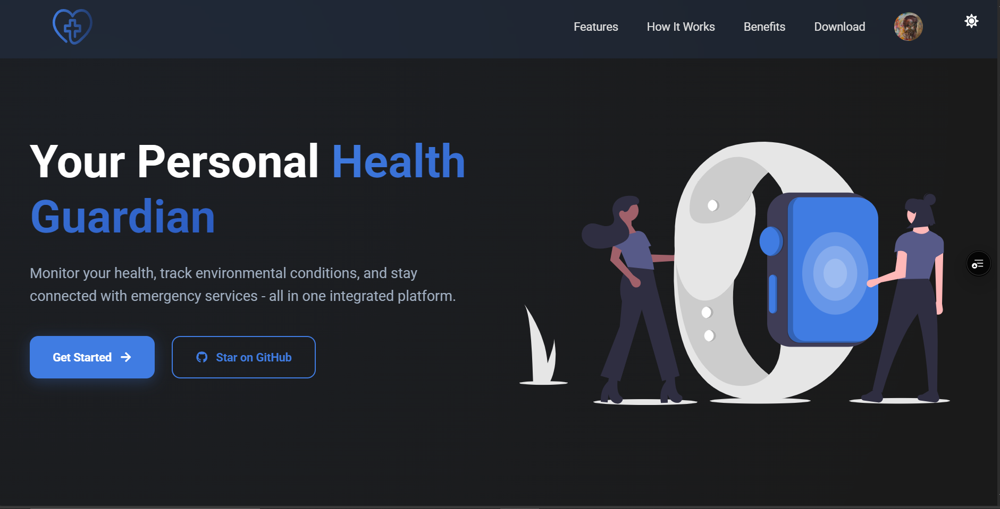
</p>

<p align="center">
  <strong>Accessible health and environmental monitoring for everyone, everywhere.</strong>
</p>

<p align="center">
  <a href="#demo">View Demo</a>
  ·
  <a href="https://github.com/evansachie/LifeGuard/issues/new?template=bug_report.md">Report Bug</a>
  ·
  <a href="https://github.com/evansachie/LifeGuard/issues/new?template=feature_request.md">Request Feature</a>
</p>

</div>

## Table of Contents

- [Overview](#-overview)
- [Technical Specifications](#-technical-specifications)
- [Machine Learning & Activity Recognition](#-machine-learning--activity-recognition)
- [System Architecture](#-system-architecture)
- [Hardware Implementation](#-hardware-implementation)
- [Getting Started](#-getting-started)
- [Project Structure](#-project-structure)
- [API Documentation](#-api-documentation)
- [Implementation Timeline](#-implementation-timeline)
- [Team](#-team)
- [Screenshots](#-screenshots)
- [Bill of Materials](#-bill-of-materials)
- [Live System Access](#-live-system-access)
- [Contributing](#-contributing)
- [License](#-license)

## Overview

LifeGuard is an innovative wearable system that bridges critical gaps in personal safety, accessibility, and preventive healthcare. By integrating advanced sensors with machine learning algorithms, it delivers real-time insights on health metrics and environmental parameters, making safety monitoring accessible and affordable for all.

### The Problem We Solve

Current health and environmental monitoring systems face several critical limitations:

- **Fragmented Solutions**: Most market solutions require multiple devices for comprehensive monitoring, leading to higher costs and added complexity
- **Limited Accessibility**: Premium devices ($400-600) exclude vulnerable populations who need them most
- **Delayed Response**: Many existing solutions fail to provide real-time alerts and updates, limiting their ability to respond promptly to critical situations
- **Missing Integration**: Health and environmental data remain siloed, preventing holistic risk assessment

### Our Solution

LifeGuard, powered by the advanced **Arduino Nicla Sense ME** board, integrates 9 sensors to deliver seamless real-time monitoring of health metrics and environmental conditions at **60% lower cost** than premium alternatives like Apple Watch.

<div align="center">
<table>
<tr>
<td align="center">
<strong>60%</strong><br>Cheaper than Apple Watch
</td>
<td align="center">
<strong>72h</strong><br>Battery Life
</td>
<td align="center">
<strong>9</strong><br>Integrated Sensors
</td>
<td align="center">
<strong>IP67</strong><br>Water Resistance
</td>
<td align="center">
<strong>99.5%</strong><br>Fall Detection Accuracy
</td>
</tr>
</table>
</div>


## Technical Specifications

### Hardware Components

<table>
  <tr>
    <td width="33%"><strong>Core Board</strong></td>
    <td width="67%">Arduino Nicla Sense ME with 9 integrated sensors</td>
  </tr>
  <tr>
    <td><strong>Processor</strong></td>
    <td>32-bit Cortex-M4 microcontroller at 64MHz</td>
  </tr>
  <tr>
    <td><strong>Health Sensor</strong></td>
    <td>MAX30102 - Heart Rate & Pulse Oximeter Module</td>
  </tr>
  <tr>
    <td><strong>Power</strong></td>
    <td>3.7V LiPo Battery (400mAh)</td>
  </tr>
  <tr>
    <td><strong>Battery Life</strong></td>
    <td>72 hours with optimized power management</td>
  </tr>
  <tr>
    <td><strong>Power Consumption</strong></td>
    <td><10mA average draw with dynamic sensor sampling</td>
  </tr>
  <tr>
    <td><strong>Durability</strong></td>
    <td>IP67 water and dust resistance</td>
  </tr>
  <tr>
    <td><strong>Weight</strong></td>
    <td>Approximately 45g (including enclosure)</td>
  </tr>
  <tr>
    <td><strong>Connectivity</strong></td>
    <td>BLE 5.0, WiFi (via companion device)</td>
  </tr>
  <tr>
    <td><strong>Display</strong></td>
    <td>LCD Screen for local data visualization</td>
  </tr>
  <tr>
    <td><strong>Built-in Sensors</strong></td>
    <td>
      • 6-Axis IMU (Accelerometer & Gyroscope)<br>
      • Temperature & Humidity sensors<br>
      • Barometric pressure sensor (high-linearity, high-accuracy)<br>
      • Magnetometer<br>
      • Gas sensors (VOCs, VSCs, CO, H₂) with AI processing<br>
      • Sensor fusion for absolute spatial orientation
    </td>
  </tr>
</table>

### Software Architecture

<div align="center">
<table>
<tr>
<th>Frontend</th>
<th>Backend</th>
<th>Mobile</th>
<th>ML & Analytics</th>
</tr>
<tr>
<td>
• React 18<br>
• TypeScript<br>
• Tailwind CSS<br>
• MapBox API<br>
</td>
<td>
• .NET 8.0<br>
• Node.js<br>
• PostgreSQL<br>
• Firebase (Real-time DB)<br>
• JWT Auth<br>
• OAuth 2.0
</td>
<td>
• Flutter 3.19<br>
• Provider State<br>
• Material 3 Design<br>
• SharedPreferences<br>
• Dark/Light Themes
</td>
<td>
• LSTM Networks<br>
• TinyML Models<br>
• Edge Impulse Platform<br>
• Edge Inference<br>
• Time-series Analysis<br>
• Sensor Fusion<br>
• Z-score Normalization<br>
• Quantization & Pruning
</td>
</tr>
</table>
</div>

### Hosting & Infrastructure

- **Frontend**: Vercel (Web hosting with global CDN)
- **Backend**: Render (API hosting with auto-scaling)
- **Database**: Neon (PostgreSQL hosting)
- **Real-time Database**: Firebase
- **CI/CD**: Automated deployment pipelines

## Machine Learning & Activity Recognition

### Edge Impulse Integration

LifeGuard incorporates state-of-the-art machine learning capabilities through **Edge Impulse** for real-time activity classification and fall detection directly on the device:

**[View Live Edge Impulse Project](https://studio.edgeimpulse.com/public/657930/live)**

<div align="center">
  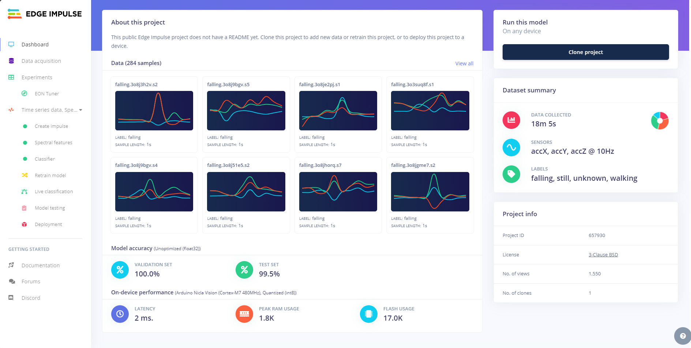
</div>

### Model Specifications

- **Model Type**: Accelerometer-based activity classification with LSTM architecture
- **Target Device**: Arduino Nicla Vision (Cortex-M7 480MHz) / Nicla Sense ME (Cortex-M4 64MHz)
- **Training Data**: 284 samples across 18+ minutes (collected: 18m 5s)
- **Performance Metrics**:
  - **Validation Accuracy**: 100.0%
  - **Test Accuracy**: 99.5%
  - **Latency**: 2ms (real-time capable)
  - **False Positive Rate**: <0.5%
- **Memory Footprint**: 
  - RAM Usage: 1.8K
  - Flash Usage: 17.0K
- **Optimization**: Quantized (int8) for efficient embedded deployment

### Activity Classifications

1. **Walking**: Normal walking activity detection with gait analysis
2. **Still**: Stationary/resting state recognition for baseline monitoring
3. **Falling**: Critical fall event detection with 99.5% accuracy
4. **Unknown**: Unclassified movement patterns flagged for review

### Data Processing Pipeline

**Input Configuration**:
- **Sensors**: AccX, AccY, AccZ (3-axis accelerometer)
- **Sampling Rate**: 10Hz for optimal battery/accuracy balance
- **Window Size**: 1-second data windows (1000ms)
- **Window Increase**: Sliding window approach for continuous monitoring

**Feature Extraction**:
- Spectral analysis of acceleration patterns
- Time-series windowing for motion data
- Z-score normalization for sensor data
- Sensor fusion combining IMU data

**Model Training**:
- Pre-trained LSTM models for temporal pattern recognition
- Transfer learning from established activity datasets
- Custom training on device-specific movement patterns
- Continuous learning capability for personalization

### Real-World Capabilities

This ML model enables:
- **Automatic Fall Detection**: Instant emergency contact notifications upon fall detection
- **Activity Pattern Analysis**: Long-term health insights from movement behaviors
- **Risk Assessment**: Predictive analytics for fall risk based on movement patterns
- **False Positive Reduction**: Correlation with heart rate variability to distinguish falls from jumps
- **Real-time Processing**: On-device inference with <500ms end-to-end latency
- **Power Efficiency**: Optimized model allowing 72h battery life with continuous monitoring

### Dataset Overview

<div align="center">
  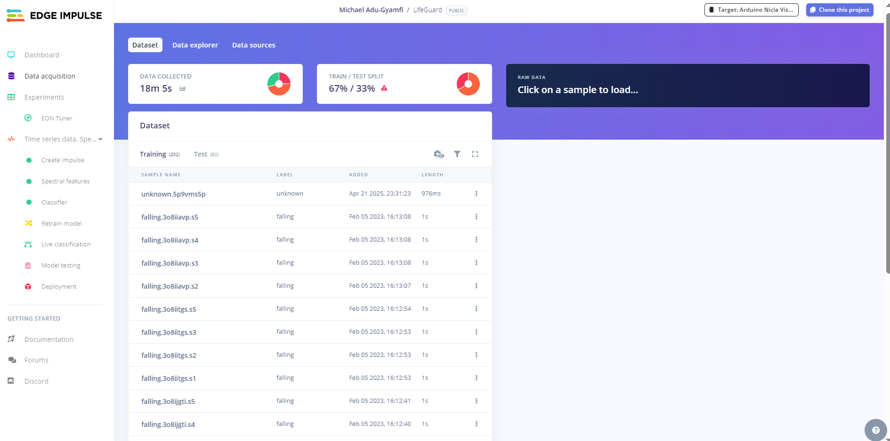
</div>

**Dataset Statistics**:
- **Total Data Collected**: 18m 5s
- **Train/Test Split**: 67% / 33%
- **Sensors Used**: accX, accY, accZ @ 10Hz
- **Labels**: falling, still, unknown, walking
- **Sample Length**: 1 second windows

## System Architecture

### High-Level Architecture

<div align="center">
  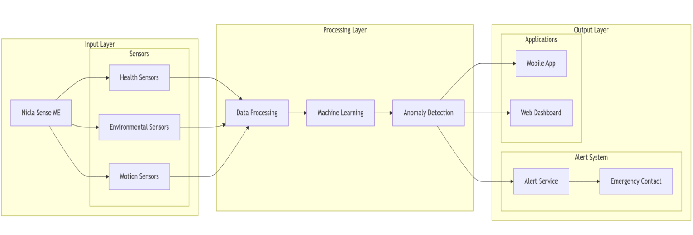
</div>

The LifeGuard system follows a distributed architecture with edge computing capabilities:

1. **Edge Layer** (Wearable Device):
   - Arduino Nicla Sense ME with integrated sensors
   - On-device ML inference for real-time fall detection
   - Local data preprocessing and filtering
   - BLE communication with companion device

2. **Gateway Layer** (Mobile/Web):
   - Data aggregation from wearable device
   - User interface for monitoring and control
   - Local caching for offline functionality
   - Alert management and notification

3. **Cloud Layer** (Backend Services):
   - .NET API for data ingestion and processing
   - PostgreSQL database with HIPAA-compliant encryption
   - Firebase for real-time data synchronization
   - Analytics and long-term trend analysis
   - Emergency contact management

4. **Integration Layer**:
   - MapBox for pollution mapping
   - MyHealthfinder API for health tips
   - Freesound API for wellness sounds
   - SendGrid for email notifications
   - OAuth providers for authentication

### Data Flow Diagram

<div align="center">
  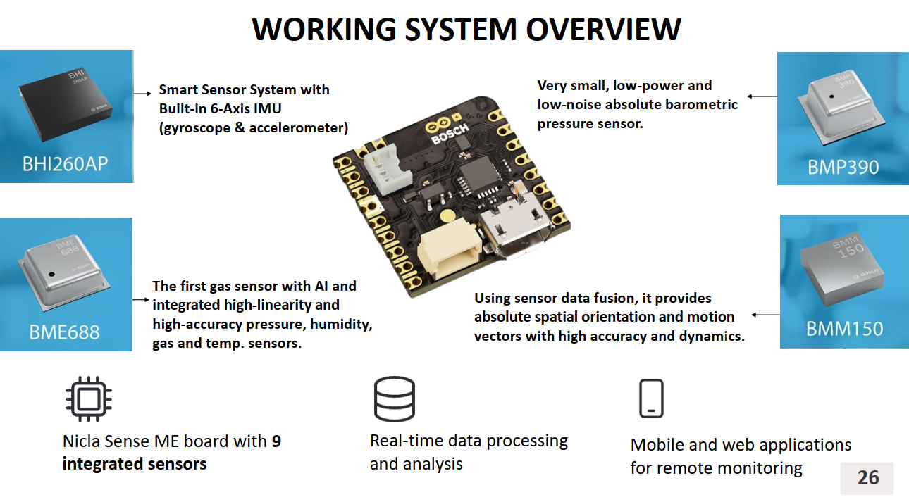
</div>

**Data Flow Process**:

1. **Data Collection**: 
   - Sensors gather health and environmental data at optimized intervals
   - MAX30102 monitors heart rate and SpO2
   - Built-in sensors track motion, air quality, and environmental conditions

2. **Edge Processing**:
   - TinyML models analyze patterns on-device
   - Real-time activity classification
   - Critical events trigger immediate local alerts
   - Data compression before transmission

3. **Data Transmission**:
   - BLE connection to companion device (smartphone)
   - Secure encrypted data packets
   - Efficient batching to minimize power consumption
   - Automatic reconnection handling

4. **Cloud Processing**:
   - Data ingestion through REST APIs
   - Storage in PostgreSQL with encryption
   - Real-time updates via Firebase
   - Advanced analytics and pattern detection

5. **User Interface**:
   - Real-time dashboard visualization on web and mobile
   - Interactive pollution maps
   - Historical trend analysis
   - Customizable alert configurations

6. **Alert System**:
   - Threshold-based automatic triggers
   - Multi-channel notifications (SMS, email, push)
   - Emergency contact cascade
   - Location sharing with emergency responders

### Pictorial System Overview

<div align="center">
  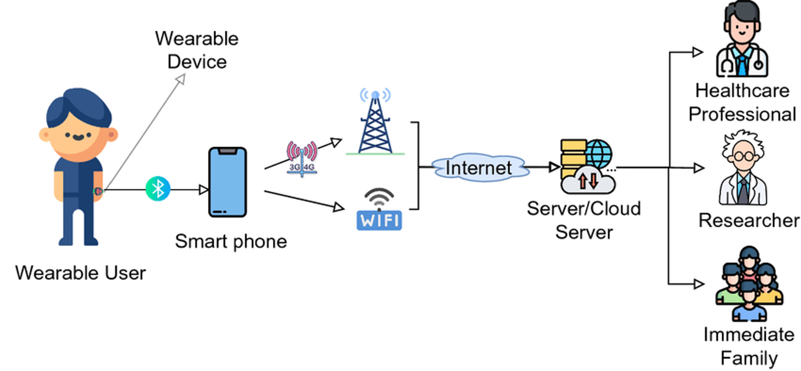
</div>

This diagram illustrates the complete ecosystem showing how the wearable device communicates with various stakeholders:
- **Wearable User**: Direct monitoring and alerts
- **Healthcare Professional**: Access to patient data and trends
- **Researcher**: Anonymous aggregated data for studies
- **Immediate Family**: Emergency notifications and status updates

## Hardware Implementation

### Physical Hardware Assembly

<div align="center">
  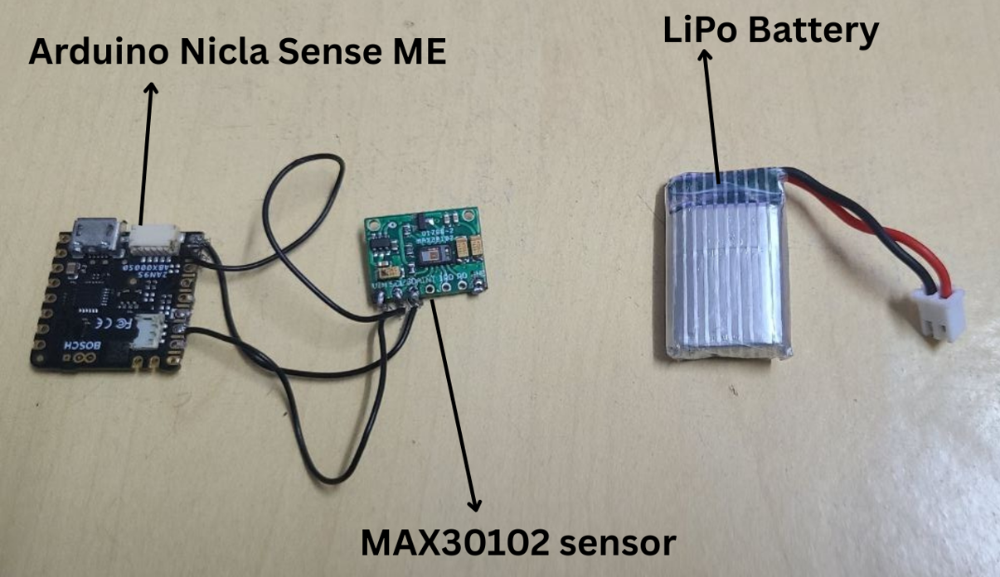
</div>

**Components**:
- Arduino Nicla Sense ME (main processing unit with 9 sensors)
- MAX30102 Sensor (heart rate and SpO2 monitoring)
- LiPo Battery 3.7V 400mAh (power supply)
- Connection wiring and interfaces

### System Block Diagram

<div align="center">
  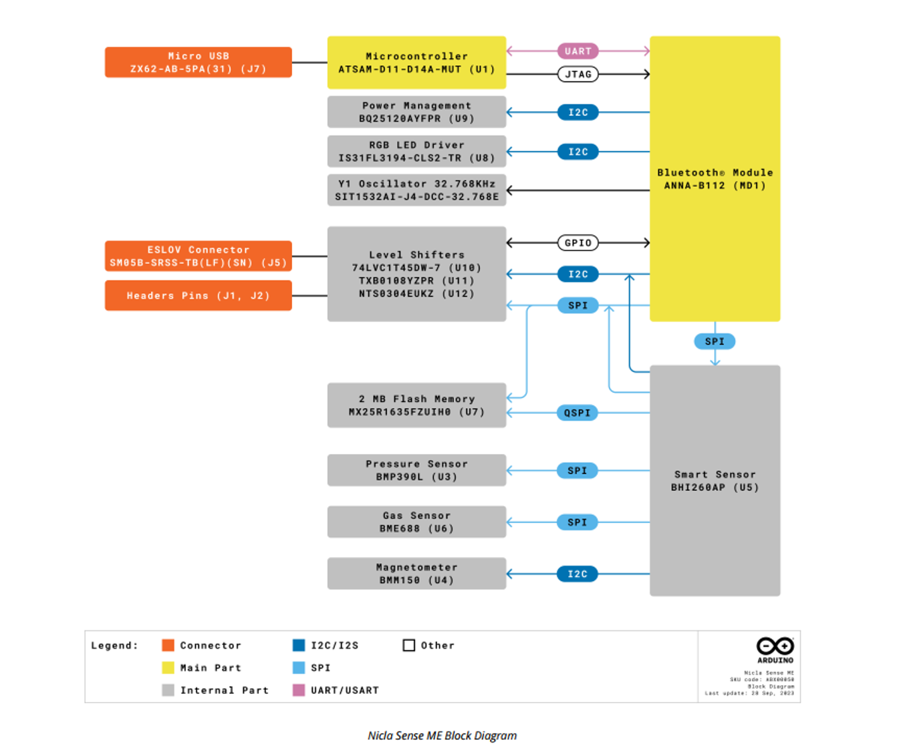
</div>

**Arduino Nicla Sense ME Features**:
- **Microcontroller**: 32-bit Cortex-M4 @ 64MHz
- **Smart Sensor Hub**: BME688 with AI for gas sensing
- **IMU**: 6-axis motion tracking (BHI260AP)
- **Pressure Sensor**: BMP390 high-accuracy barometric sensor
- **Connectivity**: Bluetooth Module (ANNA-B112) for BLE 5.0
- **Memory**: 2 MB Flash, UART/SPI/I2C interfaces
- **Power Management**: BQ25120A with battery charging
- **LED Driver**: IS31FL3194 for RGB LED control

### Pin Configuration

<div align="center">
  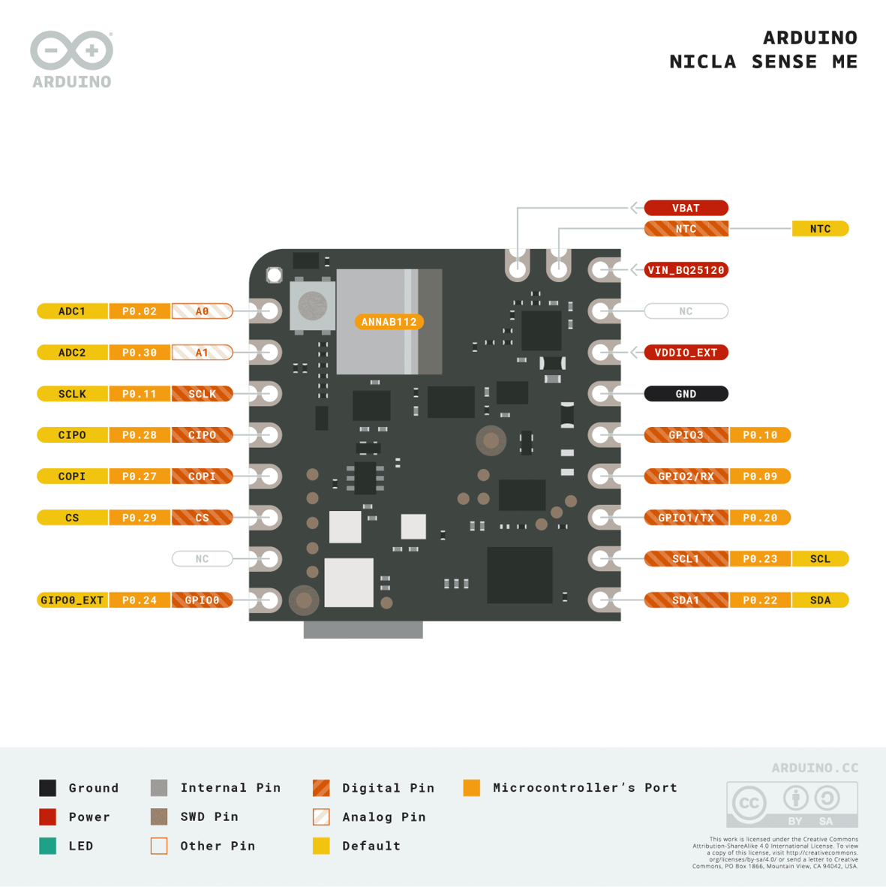
</div>

**Key Pin Connections**:
- **Power Pins**: VIN, 3.3V, GND for power distribution
- **I2C Interface**: SCL, SDA for MAX30102 sensor communication
- **Analog Pins**: A0-A4 for sensor expansion
- **Digital Pins**: D0-D13 for control signals
- **Battery Connector**: JST connector for LiPo battery
- **USB-C**: Programming and charging interface

### Hardware Schematics

<div align="center">
  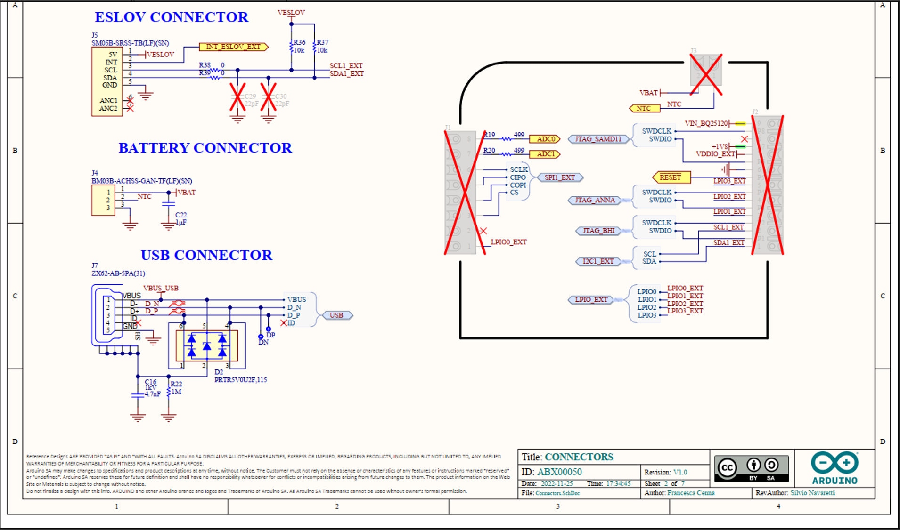
</div>

**Schematic Components**:
1. **ESLOV Connector**: For future expansion and modularity
2. **Battery Connector**: JST 2-pin for LiPo battery connection
3. **USB Connector**: USB-C for programming, debugging, and charging
4. **Power Management**: Voltage regulation and battery charging circuit
5. **Sensor Interfaces**: I2C bus connections for external sensors
6. **LED Control**: RGB LED driver circuitry

### System Wiring Diagram

<div align="center">
  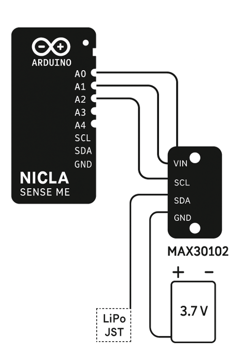
</div>

**Connection Details**:
- **Nicla Sense ME to MAX30102**: I2C connection (SCL, SDA, VIN, GND)
- **Battery to Nicla**: Direct connection via JST connector
- **Power Distribution**: 3.7V from battery regulated to 3.3V for sensors

### Device Enclosure Design

<div align="center">
  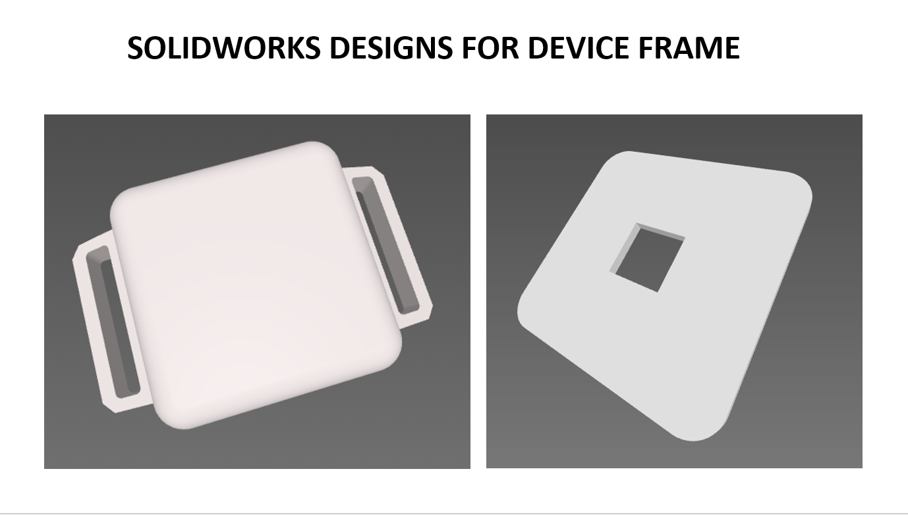
</div>

**Enclosure Features** (Designed in SolidWorks):
- Compact wearable form factor
- Watch-style wrist mounting system
- IP67-rated water and dust resistance
- Ventilation for environmental sensors
- Secure compartments for electronics
- Easy battery replacement design
- Integrated watch strap mounting points

### Final Device Design

<div align="center">
  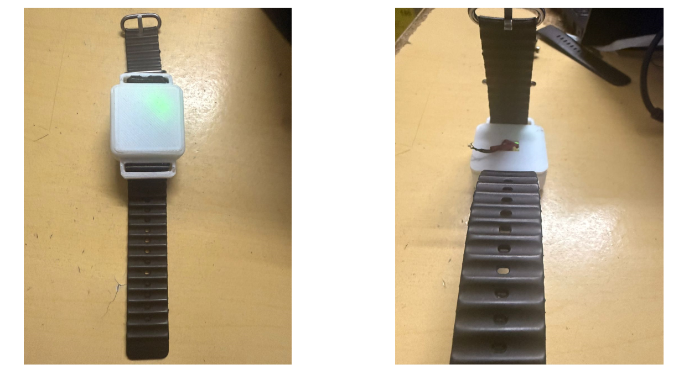
</div>

**Completed Device**:
- White protective housing with LED indicator window
- Standard watch strap for comfortable wearing
- Compact 45g total weight
- Dimensions optimized for all-day wear
- LCD screen for local display (optional)
- Button-free operation (controlled via app)

## Getting Started

### Prerequisites

**Software Requirements**:
- Node.js 18+ (for web development)
- .NET SDK 8.0 (for backend API)
- Flutter SDK 3.19+ (for mobile app)
- PostgreSQL 15+ (database)
- Arduino IDE or PlatformIO (for firmware development)
- Git (version control)

**Hardware Requirements** (for development):
- Arduino Nicla Sense ME board
- MAX30102 sensor module
- LiPo battery (3.7V, 400mAh)
- USB-C cable for programming
- Computer with Bluetooth capability

### Quick Start Guide

#### 1. Clone the Repository

```bash
git clone https://github.com/evansachie/LifeGuard.git
cd LifeGuard
```

#### 2. Set Up Environment Files

```bash
# Backend (.NET)
cp backend/.env.example backend/.env

# Node Server
cp node-server/.env.example node-server/.env

# Web Dashboard
cp web/.env.example web/.env

# Mobile App
cp mobile/.env.example mobile/.env
```

**Edit each `.env` file** with your configuration:
- Database connection strings
- API keys (MapBox, SendGrid, Freesound)
- Firebase credentials
- OAuth client IDs
- JWT secret keys

#### 3. Database Setup

```bash
# Install PostgreSQL if not already installed
# Create database
createdb lifeguard_db

# Run migrations (from backend directory)
cd backend
dotnet ef database update
```

#### 4. Start the Backend Server (.NET)

```bash
cd backend
dotnet restore
dotnet build
dotnet run
```

The API will be available at `https://localhost:5001` (or configured port)

#### 5. Start the Node Server

```bash
cd node-server
npm install
npm start
```

The Node server will run at `http://localhost:3000` (or configured port)

#### 6. Launch the Web Dashboard

```bash
cd web
npm install
npm run dev
```

Access the dashboard at `http://localhost:3000`

#### 7. Run the Mobile Application

```bash
cd mobile
flutter pub get
flutter run
```

Select your target device (iOS simulator, Android emulator, or physical device)

#### 8. Flash Firmware to Device

```bash
cd firmware
# Using Arduino IDE: Open sketch and upload
# Or using PlatformIO:
pio run --target upload
```

## Project Structure

```
lifeguard/
├── .github/                    # GitHub actions and templates
├── firmware/                   # Arduino code and sketches
│   ├── test-sketches/          # Sketches to test Nicla Sense ME
│   └── we-dashboard/           # Web dashboard for reading sensor data
├── web/                        # React dashboard
│   ├── public/                 # Static assets
│   ├── src/                    # React components
│   │   ├── components/         # Reusable UI components
│   │   ├── pages/              # Main application views
│   │   ├── services/           # API integrations
│   │   └── store/              # Redux state management
├── mobile/                     # Flutter mobile app
│   ├── lib/                    # Dart code
│   │   ├── models/             # Data models
│   │   ├── screens/            # UI screens
│   │   ├── services/           # Business logic
│   │   └── widgets/            # Reusable components
├── backend/                    # .NET Core API
│   ├── Controllers/            # API endpoints
│   ├── Models/                 # Data structures
│   ├── Services/               # Business logic
│   └── Middleware/             # Request processing
├── node-server/                # Node.js backend service
│   ├── controllers/            # Route controllers
│   ├── models/                 # Database schemas
│   ├── routes/                 # API routes
│   ├── services/               # Business logic
│   ├── middleware/             # Express middleware
│   └── utils/                  # Helper functions
├── docs/                       # Documentation
│   ├── api/                    # API reference
│   ├── images/                 # Project images
│   └── tutorials/              # User guides
└── .devcontainer/              # Development container config
```

## API Documentation

**[View Complete API Documentation on Postman](https://documenter.getpostman.com/view/28591712/2sB2qak2v6)**

The LifeGuard API is split across two backend services for optimal performance and modularity:

### .NET Backend Service
**Base URL**: `https://lifeguard-hiij.onrender.com`

Handles user authentication, account management, and photo storage.

#### Authentication Endpoints

| Method | Endpoint | Description | Auth Required |
|--------|----------|-------------|---------------|
| GET | `/` | Health check endpoint | No |
| POST | `/api/Account/login` | User login with email/password | No |
| POST | `/api/Account/register` | Register new user account | No |
| POST | `/api/Account/forgot-password` | Initiate password recovery | No |
| POST | `/api/Account/ResendOTP` | Resend OTP to user | No |
| POST | `/api/Account/VerifyOTP` | Verify user OTP | No |
| POST | `/api/Account/ResetPassword` | Reset password with token | No |
| POST | `/api/Account/CompleteProfile` | Complete user profile setup | Yes |
| GET | `/api/Account/{id}` | Get account info by ID | Yes |
| GET | `/api/Account/GetProfile/{id}` | Get detailed profile | Yes |
| GET | `/api/Account/google-login` | Initiate Google OAuth | No |
| GET | `/api/Account/signin-google` | Google OAuth callback | No |
| DELETE | `/api/Account/{id}` | Delete user account | Yes |

#### Photo Management Endpoints

| Method | Endpoint | Description | Auth Required |
|--------|----------|-------------|---------------|
| POST | `/{id}/photo` | Upload user photo | Yes |
| DELETE | `/{id}/photo` | Delete user photo | Yes |
| GET | `/{id}/photo` | Retrieve user photo | Yes |

### Node.js Backend Service
**Base URL**: `https://lifeguard-node.onrender.com`

Handles health metrics, emergency contacts, medications, and advanced AI features.

#### Memo Endpoints

| Method | Endpoint | Description | Auth Required |
|--------|----------|-------------|---------------|
| GET | `/api/memos` | Get user memos | Yes |
| POST | `/api/memos` | Create new memo | Yes |
| GET | `/api/memos/undone/count` | Count of incomplete memos | Yes |

#### Emergency Contact Endpoints

| Method | Endpoint | Description | Auth Required |
|--------|----------|-------------|---------------|
| GET | `/api/emergency-contacts` | Get emergency contacts | Yes |
| POST | `/api/emergency-contacts` | Add emergency contact | Yes |
| POST | `/api/emergency-contacts/alert` | Send emergency alert | Yes |
| GET | `/api/emergency-contacts/test-alert/{id}` | Test alert to contact | Yes |
| GET | `/api/emergency-contacts/verify` | Verify contact with token | No |
| GET | `/api/emergency-contacts/alerts` | Get alert history | Yes |

#### Health Metrics Endpoints

| Method | Endpoint | Description | Auth Required |
|--------|----------|-------------|---------------|
| GET | `/api/health-metrics/latest` | Get latest metrics | Yes |
| POST | `/api/health-metrics/save` | Save new metrics | Yes |
| GET | `/api/health-metrics/history` | Get metrics history (last 10) | Yes |

#### Exercise Endpoints

| Method | Endpoint | Description | Auth Required |
|--------|----------|-------------|---------------|
| GET | `/api/exercise/stats` | Get exercise stats & streaks | Yes |
| POST | `/api/exercise/complete` | Record workout session | Yes |
| POST | `/api/exercise/goals` | Set/update workout goals | Yes |
| GET | `/api/exercise/workout-history` | Get workout history | Yes |
| GET | `/api/exercise/calories-history` | Get calories history | Yes |
| GET | `/api/exercise/streak-history` | Get streak history | Yes |

#### Medication Endpoints

| Method | Endpoint | Description | Auth Required |
|--------|----------|-------------|---------------|
| GET | `/api/medications` | Get all medications | Yes |
| POST | `/api/medications/add` | Add new medication | Yes |
| PUT | `/api/medications/:id` | Update medication | Yes |
| DELETE | `/api/medications/:id` | Delete medication | Yes |
| POST | `/api/medications/track` | Track dose (taken/skipped) | Yes |
| GET | `/api/medications/compliance` | Get compliance rate | Yes |
| GET | `/api/medications/emergency/:userId` | Emergency medication info | No |

#### Health Tips Endpoints

| Method | Endpoint | Description | Auth Required |
|--------|----------|-------------|---------------|
| GET | `/api/health-tips` | Get health tips from MyHealthfinder | Yes |
| GET | `/api/health-tips/topic/:id` | Get specific topic details | Yes |

#### Sound & Wellness Endpoints

| Method | Endpoint | Description | Auth Required |
|--------|----------|-------------|---------------|
| POST | `/api/freesound/audio-proxy` | Proxy Freesound audio | Yes |
| GET | `/api/favorite-sounds` | Get all favorite sounds | Yes |
| GET | `/api/favorite-sounds/{userId}` | Get user favorites | Yes |
| DELETE | `/api/favorite-sounds/{userId}/{soundId}` | Remove from favorites | Yes |

#### RAG System Endpoints (AI Document Q&A)

| Method | Endpoint | Description | Auth Required |
|--------|----------|-------------|---------------|
| POST | `/api/upload` | Upload PDF for processing | Yes |
| POST | `/api/ask` | Ask question about PDFs | Yes |

**RAG System Features**:
- Upload health documents (prescriptions, lab reports, medical records)
- Intelligent document parsing and text extraction
- Vector embeddings for semantic search
- Natural language question answering
- Context-aware responses with source citations

#### Voice Commands Endpoints

| Method | Endpoint | Description | Auth Required |
|--------|----------|-------------|---------------|
| POST | `/api/voice-commands/process` | Process voice command with NLP | Yes |
| POST | `/api/voice-commands/emergency` | Emergency voice command | Yes |
| GET | `/api/voice-commands/commands` | Get available commands | Yes |

**Supported Voice Commands**:
- "Check my heart rate"
- "Show air quality"
- "Call emergency contact"
- "Start meditation"
- "Record workout"

#### User Preferences Endpoints

| Method | Endpoint | Description | Auth Required |
|--------|----------|-------------|---------------|
| GET | `/api/user-preferences/notifications` | Get notification settings | Yes |
| POST | `/api/user-preferences/notifications` | Update notification settings | Yes |
| POST | `/api/user-preferences/send-test-email` | Send test notification | Yes |

## Implementation Timeline

<div align="center">
  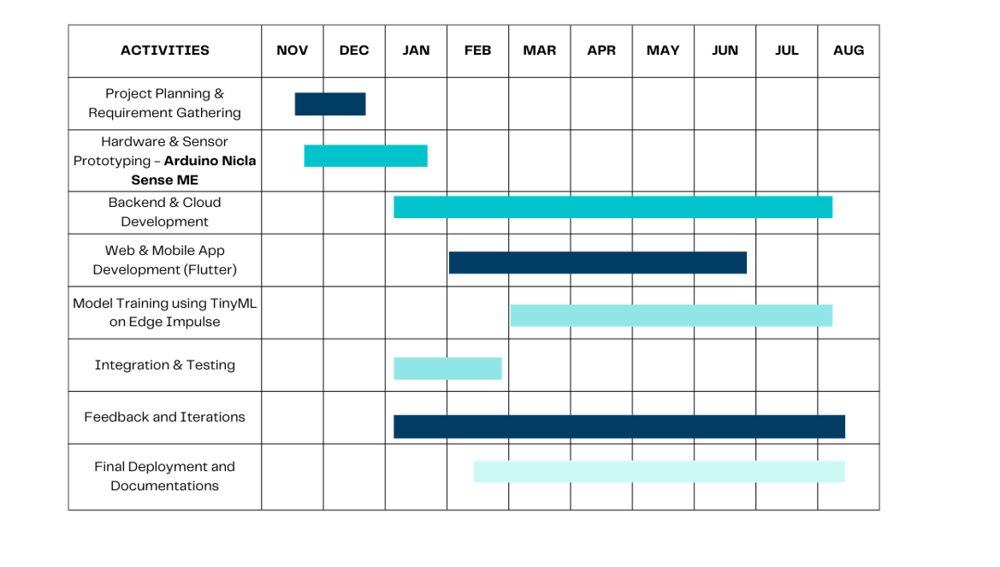
</div>


### Core Developers

<table>
  <tr>
    <td align="center" width="50%">
      <a href="https://github.com/evansachie">
        
        <br />
        <sub><b>Evans Acheampong</b></sub>
      </a>
      <br />
      <strong>Full Stack & Hardware Lead</strong>
      <br />
      <em>University of Ghana</em>
      <br /><br />
      <strong>Responsibilities:</strong>
      <ul align="left">
        <li>Hardware integration & sensor optimization</li>
        <li>Firmware development (Arduino/C++)</li>
        <li>Frontend development (React, Flutter)</li>
        <li>Node.js backend services</li>
        <li>User interface design & testing</li>
        <li>System documentation</li>
        <li>Project management</li>
      </ul>
    </td>
    <td align="center" width="50%">
      <a href="https://github.com/mikkayadu">
        
        <br />
        <sub><b>Michael Adu-Gyamfi</b></sub>
      </a>
      <br />
      <strong>Backend & ML Lead</strong>
      <br />
      <em>University of Ghana</em>
      <br /><br />
      <strong>Responsibilities:</strong>
      <ul align="left">
        <li>Backend development (.NET, PostgreSQL)</li>
        <li>Machine learning model development</li>
        <li>Edge Impulse ML pipeline</li>
        <li>Firmware optimization</li>
        <li>Data analytics & processing</li>
        <li>System security (encryption, CI/CD)</li>
        <li>Firebase real-time database</li>
      </ul>
    </td>
  </tr>
</table>

### Academic Advisors

<table>
  <tr>
    <td align="center" width="33%">
      <br />
      <sub><b>Dr. Percy Okae</b></sub>
      <br />
      <strong>Project Supervisor</strong>
      <br />
      <em>Department of Computer Engineering<br>University of Ghana</em>
      <br /><br />
      Provided academic guidance, technical supervision, and project oversight throughout the development process.
    </td>
    <td align="center" width="33%">
      <br />
      <sub><b>Chiratidzo Matowe</b></sub>
      <br />
      <strong>Project Advisor</strong>
      <br />
      <em>University of Ghana</em>
      <br /><br />
      Offered technical advice on system architecture, user experience design, and industry best practices.
    </td>
    <td align="center" width="33%">
      <br />
      <sub><b>Marvin Rotermund</b></sub>
      <br />
      <strong>Ambassador</strong>
      <br />
      <em>Embedded Learning Challenge<br>Edge Impulse</em>
      <br /><br />
      Provided guidance on machine learning implementation, Edge Impulse platform utilization, and embedded AI optimization.
    </td>
  </tr>
</table>


## Screenshots

### Web Dashboard

<div align="center">
  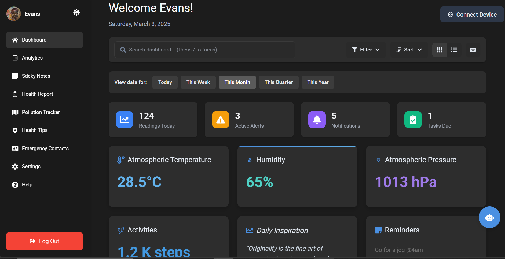
  <p><em>Main dashboard showing real-time health metrics, environmental data, and activity summary</em></p>
</div>

### Analytics Panel

<div align="center">
  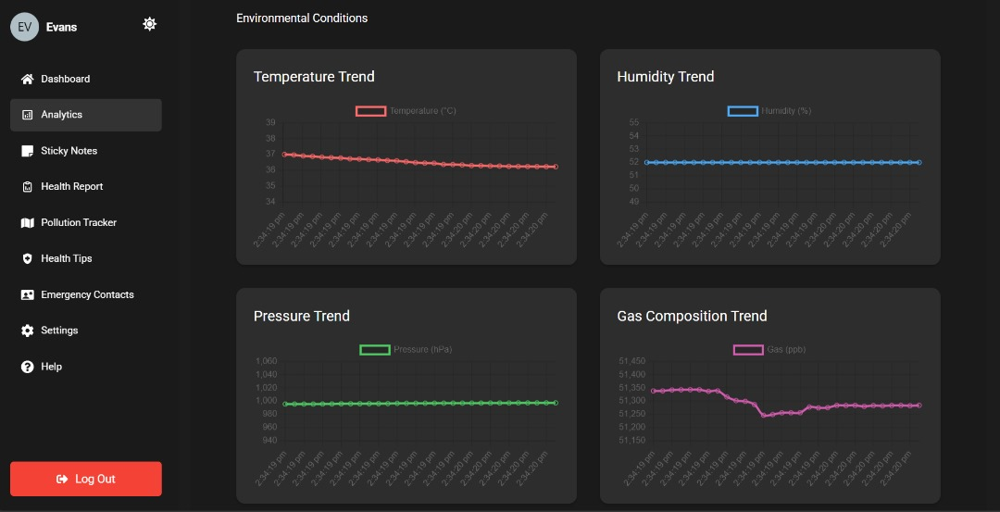
  <p><em>Comprehensive analytics with historical trends, charts, and insights</em></p>
</div>

### Sticky Notes & Task Management

<div align="center">
  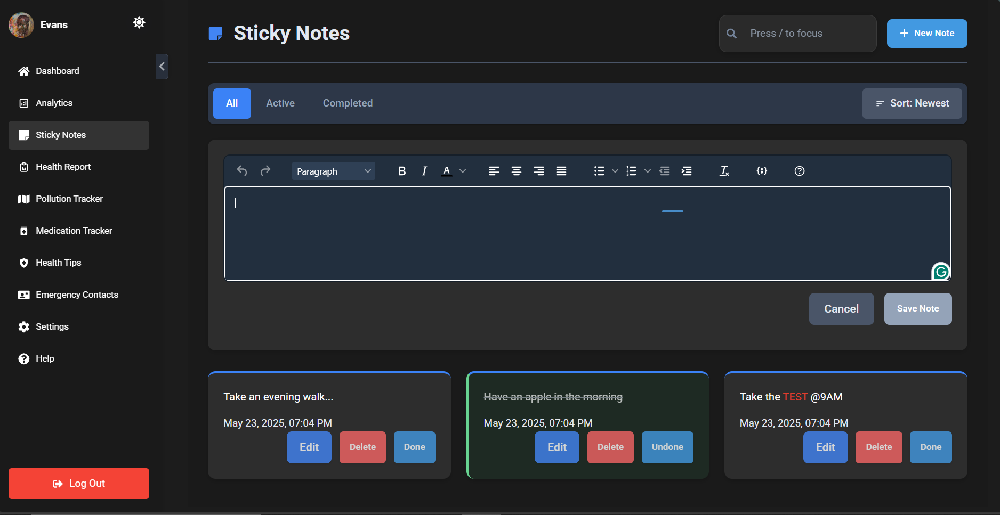
  <p><em>Memo and task management system for health reminders and daily notes</em></p>
</div>

### Health Report

<div align="center">
  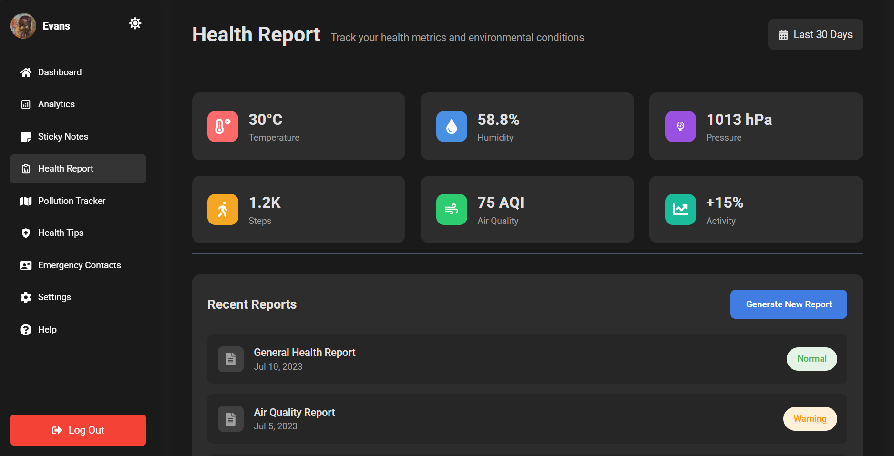
  <p><em>Detailed health report with metrics, trends, and personalized insights</em></p>
</div>

### Pollution Tracker Map

<div align="center">
  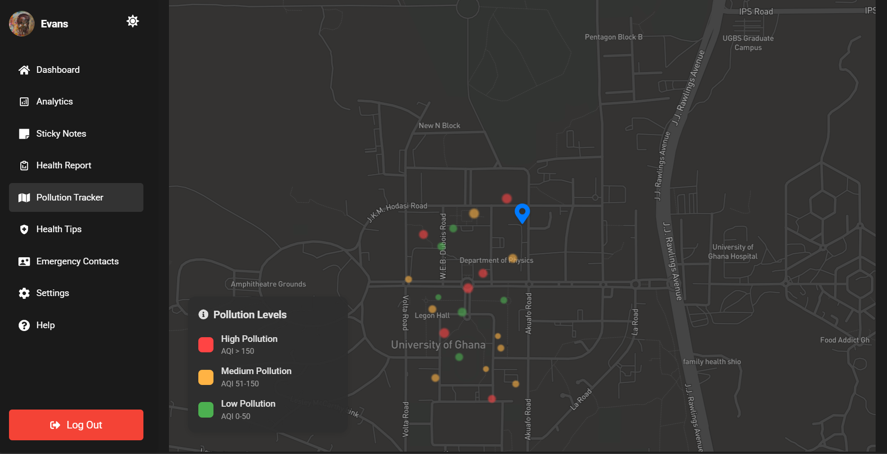
  <p><em>Interactive MapBox-powered pollution map showing air quality data and user location</em></p>
</div>

### Health Tips

<div align="center">
  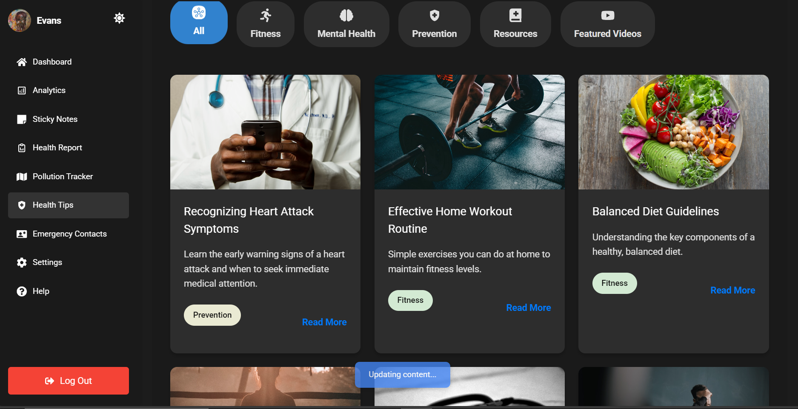
  <p><em>Personalized health tips from MyHealthfinder API based on user profile and health data</em></p>
</div>

### Emergency Contacts

<div align="center">
  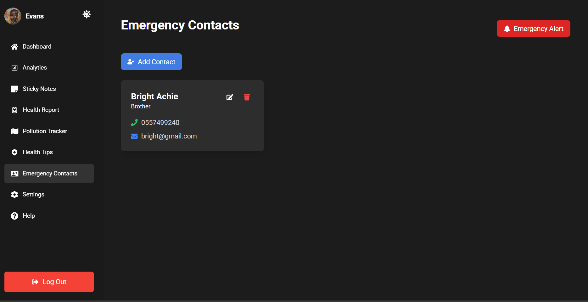
  <p><em>Emergency contact management with verification system and test alert functionality</em></p>
</div>

### Help & Support

<div align="center">
  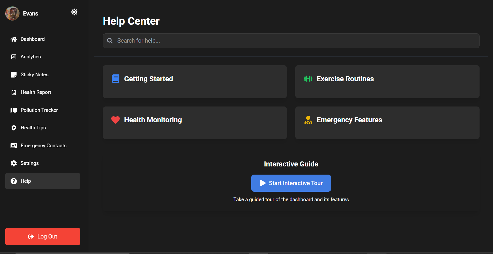
  <p><em>Comprehensive help center with FAQs, tutorials, and support resources</em></p>
</div>

### User Profile

<div align="center">
  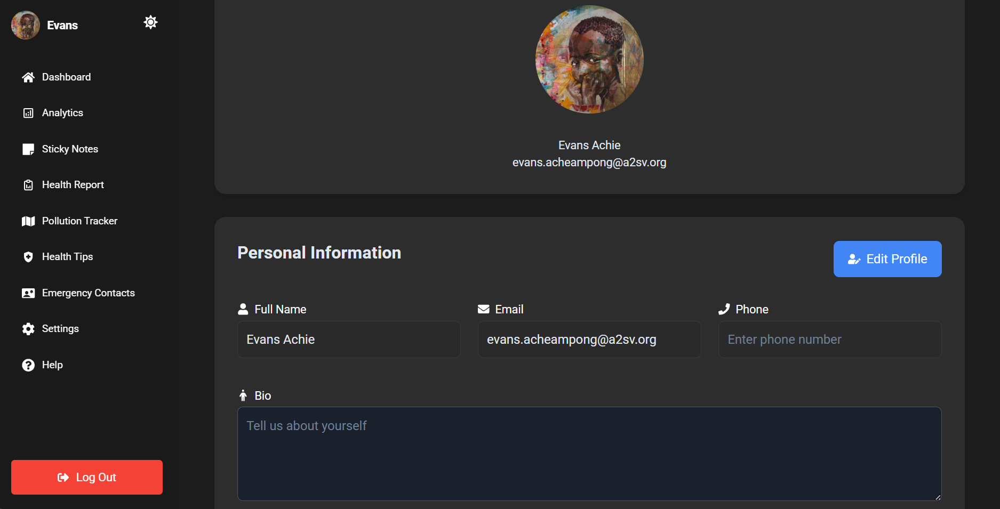
  <p><em>User profile management with health information, preferences, and account settings</em></p>
</div>

### Exercise Routines

<div align="center">
  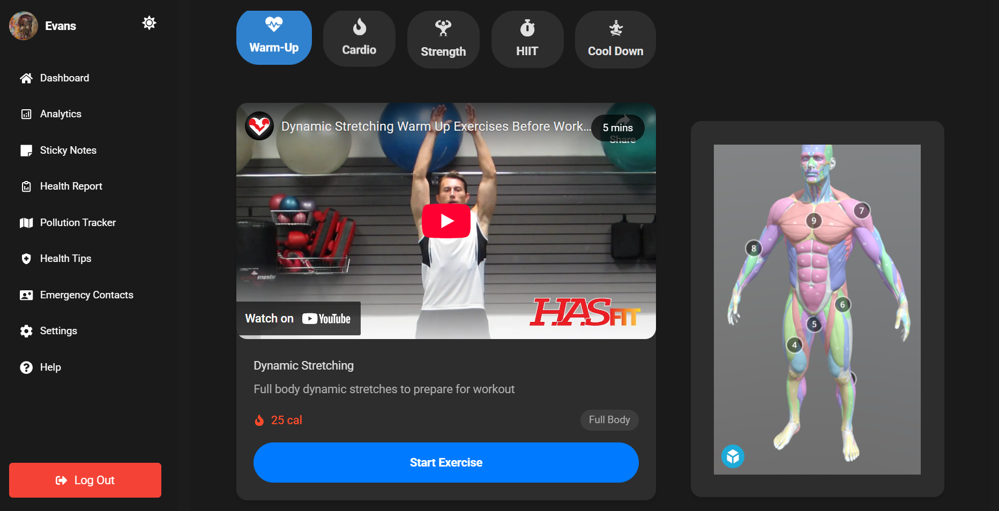
  <p><em>Exercise tracking with workout routines, calories burned, and streak monitoring</em></p>
</div>

### Wellness Hub - Breathing Exercises

<div align="center">
  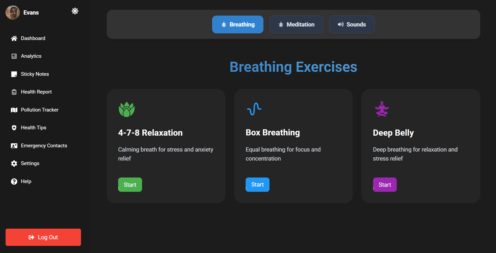
  <p><em>Guided breathing exercises for stress relief and relaxation</em></p>
</div>

### Wellness Hub - Meditation

<div align="center">
  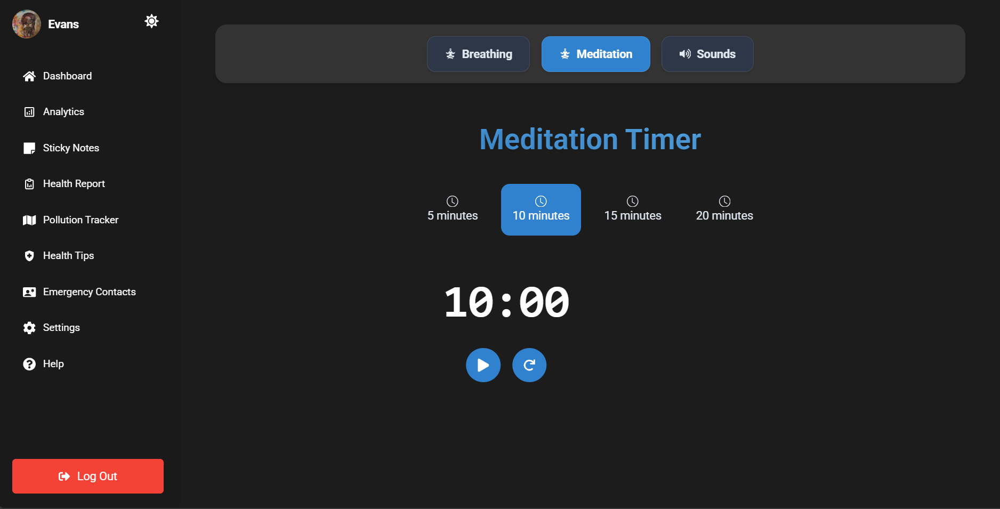
  <p><em>Meditation sessions with timer and ambient sound options</em></p>
</div>

### Wellness Hub - Zen Sounds

<div align="center">
  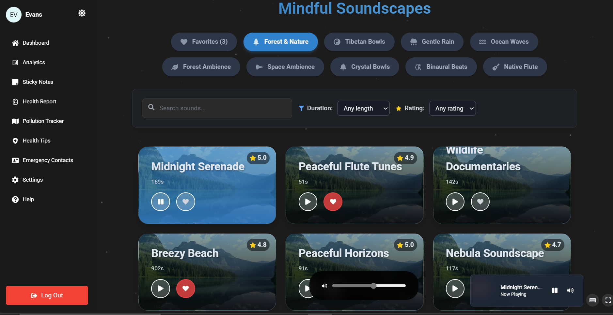
  <p><em>Curated ambient sounds from Freesound API for relaxation and focus</em></p>
</div>

### Health Metrics Calculator

<div align="center">
  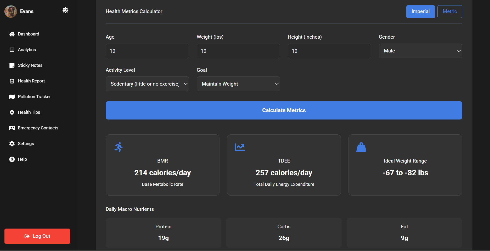
  <p><em>Interactive calculator for BMI, BMR, ideal weight, and other health metrics</em></p>
</div>

### Device Dashboard - Live Sensor Data

<div align="center">
  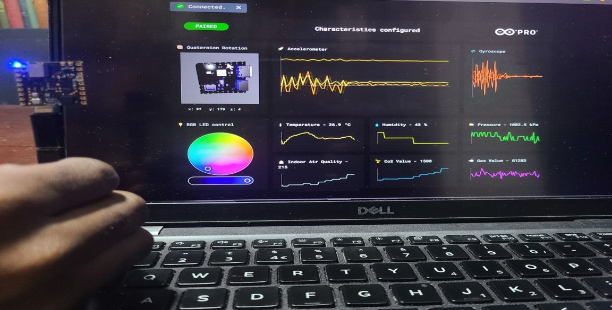
  <p><em>Real-time device dashboard showing live sensor data streams with interactive controls</em></p>
</div>


## Bill of Materials

### Core Components

| Item | Description | Cost (GH₵) | Quantity | Total (GH₵) |
|------|-------------|------------|----------|-------------|
| **Arduino Nicla Sense ME** | Main processing unit with 9 integrated sensors (IMU, temp, humidity, pressure, magnetometer, gas sensors) | 1,500.00 | 1 | 1,500.00 |
| **MAX30102 Sensor** | Heart Rate & Pulse Oximeter Module with I2C interface | 64.00 | 1 | 64.00 |
| **LiPo Battery** | 3.7V 400mAh rechargeable battery with JST connector | 95.00 | 1 | 95.00 |
| **LCD Screen** | Small display for local data visualization (optional) | 90.00 | 1 | 90.00 |
| **Custom Enclosure** | 3D-printed housing with watch straps | ~50.00 | 1 | 50.00 |

### **Total Estimated Cost: GH₵ 1,799.00 (~$113 USD)**

### Additional Development Costs (Not per-unit)

| Item | Purpose | Cost Range |
|------|---------|------------|
| **3D Printer Access** | Enclosure prototyping | GH₵ 500 - 1,000 |
| **Development Tools** | Software licenses, cloud services | GH₵ 1,000 - 2,000 |
| **Testing Equipment** | Multimeters, oscilloscope access | GH₵ 500 - 1,500 |
| **PCB Prototyping** | Custom circuit boards (if scaled) | GH₵ 2,000+ |

### Cost Comparison with Market Alternatives

| Device | Price Range | LifeGuard Advantage |
|--------|-------------|---------------------|
| **Apple Watch Series 9** | $399 - $799 | **60% cheaper**, similar sensors |
| **Fitbit Sense 2** | $249 - $299 | **62% cheaper**, more environmental sensors |
| **Samsung Galaxy Watch 6** | $299 - $429 | **65% cheaper**, open-source software |
| **Garmin Venu 3** | $449 - $499 | **72% cheaper**, specialized health focus |

### Scalability & Manufacturing

**Current Cost Structure** (Prototype):
- Hand-assembled units
- 3D-printed enclosures
- Off-the-shelf components
- Estimated cost per unit: **GH₵ 1,800**

**Projected Cost at Scale** (1,000+ units):
- Injection-molded enclosures: -30%
- Bulk component purchasing: -20%
- Automated assembly: -15%
- **Projected cost per unit: GH₵ 900 - 1,100**

**Target Retail Price**: GH₵ 1,500 - 2,000 ($95 - $125)

## Live System Access

<table>
  <tr>
    <td align="center" width="50%">
      <strong>Web Dashboard</strong><br>
      <a href="https://lifeguard-vert.vercel.app">https://lifeguard-vert.vercel.app</a>
      <br><br>
      Full-featured web application with:
      <ul align="left">
        <li>Real-time health monitoring</li>
        <li>Interactive analytics</li>
        <li>Pollution mapping</li>
        <li>Wellness features</li>
        <li>Device management</li>
      </ul>
    </td>
    <td align="center" width="50%">
      <strong>Mobile App</strong><br>
      <em>Flutter App (iOS & Android)</em>
      <br><br>
      Download and install:
      <ul align="left">
        <li>BLE device pairing</li>
        <li>Real-time notifications</li>
        <li>Offline data sync</li>
        <li>Emergency SOS</li>
        <li>Activity tracking</li>
      </ul>
    </td>
  </tr>
  <tr>
    <td align="center">
      <strong>.NET API</strong><br>
      <a href="https://lifeguard-hiij.onrender.com/api">https://lifeguard-hiij.onrender.com/api</a>
      <br><br>
      Core backend services:
      <ul align="left">
        <li>User authentication</li>
        <li>Profile management</li>
        <li>Photo storage</li>
        <li>OAuth integration</li>
      </ul>
    </td>
    <td align="center">
      <strong>Node.js API</strong><br>
      <a href="https://lifeguard-node.onrender.com">https://lifeguard-node.onrender.com</a>
      <br><br>
      Specialized microservices:
      <ul align="left">
        <li>Health metrics</li>
        <li>Emergency alerts</li>
        <li>Medication tracking</li>
        <li>AI features (RAG, Voice)</li>
      </ul>
    </td>
  </tr>
</table>


## Contributing

We welcome contributions from the community! LifeGuard is an open-source project aimed at making health monitoring accessible to all.


## License

This project is licensed under the **MIT License** - see the [LICENSE](LICENSE) file for details.

### Citation

If you use LifeGuard in your research or project, please cite:

```bibtex
@misc{lifeguard2025,
  title={LifeGuard: Wearable Health and Environmental Monitoring System},
  author={Acheampong, Evans and Adu-Gyamfi, Michael Kwabena},
  year={2025},
  institution={University of Ghana},
  url={https://github.com/evansachie/LifeGuard}
}
```

### Acknowledgments

We would like to express our gratitude to:

- **University of Ghana** for providing facilities and academic support
- **Dr. Percy Okae** for invaluable guidance and supervision
- **Chiratidzo Matowe** for technical advice and mentorship
- **Marvin Rotermund** and **Edge Impulse** for ML platform and support
- **Arduino** for the amazing Nicla Sense ME platform
- **Our user testers** for valuable feedback and patience
- **Open-source community** for tools and libraries that made this possible

---
